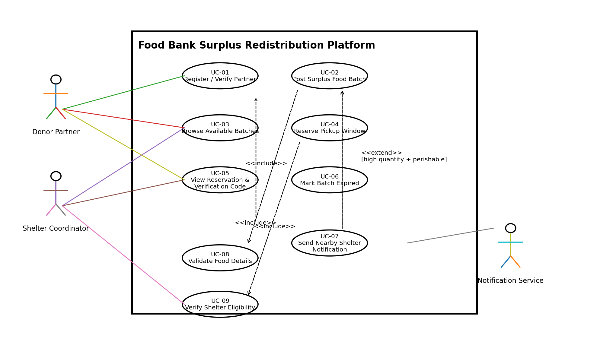

# SE Lab 1: Requirements Engineering & UML Use-Case Modelling

**Name-** Harshith Kumar S  
**SRN-** PES1UG25CS815  
**Course:** Software Engineering Lab  
**Institution:** PES University – Dept. of CSE  
**Problem Statement #62:** Sustainability & Green Tech  
**Project:** Food Bank Surplus Redistribution Platform  

---

## 📌 Project Overview

The **Food Bank Surplus Redistribution Platform** is a food rescue platform where restaurants and grocery stores post surplus edible food batches, and verified local shelters reserve pickup windows before food expiry.

The objective is to reduce food wastage by connecting surplus food donors with verified local shelters and enabling timely pickup before the food expires.

---

## 📂 Deliverables Overview

- 📄 **Problem Statement:** [`docs/Problem_Statement.pdf`](docs/Problem_Statement.pdf)
- 📋 **Requirements Specification:** [`docs/Requirements_Specification.md`](docs/Requirements_Specification.md)
- 📝 **Requirements Table:** [`docs/Requirements_Table.docx`](docs/Requirements_Table.docx)
- 📊 **Requirements Table (Excel):** [`docs/Requirements_Table.xlsx`](docs/Requirements_Table.xlsx)
- 📝 **Use Case Flow (Editable):** [`docs/Use_Case_Flow.docx`](docs/Use_Case_Flow.docx)
- 📄 **Use Case Flow PDF:** [`docs/Use_Case_Flow.pdf`](docs/Use_Case_Flow.pdf)
- 📐 **UML Diagram:** [`diagrams/UML_Use_Case_Diagram.pdf`](diagrams/UML_Use_Case_Diagram.pdf)
- 🖼️ **UML Diagram Image:** [`diagrams/UML_Use_Case_Diagram.png`](diagrams/UML_Use_Case_Diagram.png)
- 💻 **UML Diagram Source:** [`diagrams/use_case_diagram.puml`](diagrams/use_case_diagram.puml)

---

# 1. Requirements Engineering

## 1.1 Functional Requirements

The project contains exactly **5 Functional Requirements (FR-001 to FR-005)** as required by Lab 1.

| Req ID | Description | Priority | Acceptance Criteria | Rationale |
|---|---|---|---|---|
| **FR-001** | The system shall allow donors to post surplus food packages with perishable expiry countdown timers and dietary tags. | **High** | **Pass:** A valid batch with quantity, expiry time and dietary tags appears on the claim board with a countdown. **Fail:** Required information is missing or an expired batch remains active. | Makes surplus edible food visible to verified shelters before expiry. |
| **FR-002** | The system shall allow verified shelters to browse and filter active surplus food batches by location, expiry time, quantity and dietary tags. | **High** | **Pass:** Filters return the correct active batches. **Fail:** Expired or non-matching batches are displayed as available. | Helps shelters quickly find suitable food. |
| **FR-003** | The system shall allow a verified shelter to reserve an available food batch and select an available pickup window before the batch expires. | **High** | **Pass:** The shelter receives a confirmed reservation, pickup window and unique verification code. **Fail:** An expired or already reserved batch can be reserved. | Connects surplus food with confirmed local pickup. |
| **FR-004** | The system shall allow authorized donor partners and shelter coordinators to view reservation status and the pickup verification code for a confirmed batch. | **Medium** | **Pass:** Authorized users can view the correct reservation status and code. **Fail:** Unauthorized users can access reservation information. | Supports reliable food handover. |
| **FR-005** | The system shall automatically mark a food batch as expired and prevent further reservation when its expiry time is reached. | **High** | **Pass:** The batch changes to Expired and cannot be reserved after expiry. **Fail:** An expired batch remains reservable. | Prevents invalid claims after the expiry deadline. |

---

## 1.2 Non-Functional Requirements

The project contains exactly **2 Non-Functional Requirements (NFR-001 and NFR-002)**.

| Req ID | Description | Priority | Acceptance Criteria | Rationale |
|---|---|---|---|---|
| **NFR-001** | The platform shall dispatch instant push notifications to shelters within a 5 km radius when high-quantity perishable food is listed. | **High** | **Pass:** Eligible shelters within 5 km receive the notification within the configured notification target. **Fail:** An eligible shelter is missed or an out-of-radius shelter receives the alert. | Enables rapid redistribution of highly perishable food. |
| **NFR-002** | The platform shall protect donor and shelter account data using authenticated role-based access control, and reservation actions shall be recorded with a timestamp. | **High** | **Pass:** Unauthorized users cannot perform restricted actions and successful reservations contain user and timestamp information. **Fail:** A restricted action succeeds without authorization or no timestamp is recorded. | Protects participant data and provides reservation traceability. |

---

# 2. Actors

### 👤 Donor Partner

- Posts surplus edible food batches.
- Provides quantity, expiry information and dietary tags.
- Views reservation and pickup verification information.

### 👤 Shelter Coordinator

- Browses available surplus food.
- Filters food batches.
- Reserves pickup windows.
- Views reservation and verification information.

### 🔔 Notification Service

- Sends notifications to eligible nearby shelters when high-quantity perishable food is posted.

---

# 3. UML Use-Case Diagram

## 3.1 Use Cases

The system consists of the following use cases:

| Use Case ID | Use Case |
|---|---|
| **UC-01** | Register / Verify Partner |
| **UC-02** | Post Surplus Food Batch |
| **UC-03** | Browse Available Batches |
| **UC-04** | Reserve Pickup Window |
| **UC-05** | View Reservation & Verification Code |
| **UC-06** | Mark Batch Expired |
| **UC-07** | Send Nearby Shelter Notification |
| **UC-08** | Validate Food Details |
| **UC-09** | Verify Shelter Eligibility |

### Use-Case Diagram



**[📄 Open UML Diagram PDF](diagrams/UML_Use_Case_Diagram.pdf)**

---

## 3.2 UML Relationships

| Use Case ID | Use Case |
|---|---|
| **UC-01** | Register / Verify Partner |
| **UC-02** | Post Surplus Food Batch |
| **UC-03** | Browse Available Batches |
| **UC-04** | Reserve Pickup Window |
| **UC-05** | View Reservation & Verification Code |
| **UC-06** | Mark Batch Expired |
| **UC-07** | Send Nearby Shelter Notification |
| **UC-08** | Validate Food Details |
| **UC-09** | Verify Shelter Eligibility |

---

## 3.2 UML Relationships

### `<<include>>`

**UC-02 – Post Surplus Food Batch**

includes

**UC-08 – Validate Food Details**

Food details must be validated before a surplus batch can be posted.

### `<<include>>`

**UC-04 – Reserve Pickup Window**

includes

**UC-09 – Verify Shelter Eligibility**

Only verified shelters can reserve food batches.

### `<<extend>>`

**UC-07 – Send Nearby Shelter Notification**

extends

**UC-02 – Post Surplus Food Batch**

The notification is triggered when the listed food is high-quantity and perishable.

---

# 4. Use-Case Flow Specification

## UC-04 – Reserve Pickup Window

**Primary Actor:** Shelter Coordinator

### Preconditions

1. The Shelter Coordinator is authenticated.
2. The shelter is verified.
3. An active surplus food batch is available.
4. The selected batch has not expired.

### Postconditions

1. The food batch is reserved.
2. The selected pickup window is recorded.
3. A unique pickup verification code is generated.
4. Authorized users can view the reservation information.

---

## Main Success Scenario

1. The Shelter Coordinator opens the list of active surplus food batches.
2. The system displays available batches with quantity, dietary tags, location and expiry countdown.
3. The Shelter Coordinator selects a suitable food batch.
4. The system verifies the shelter and checks that the batch is still available.
5. The Shelter Coordinator selects an available pickup window before expiry.
6. The system creates the reservation.
7. The system marks the batch as reserved.
8. The system generates a unique pickup verification code.
9. The system displays the reservation confirmation, pickup window and verification code.
10. The system confirms that the reservation has been successfully completed.

---

## Alternate Flow – Expired or Already Reserved Batch

1. The system detects that the selected batch has expired or has already been reserved.
2. The reservation request is rejected.
3. The system displays the reason to the Shelter Coordinator.
4. The batch is removed from the reservable list.
5. The Shelter Coordinator can select another available batch.

**[📄 View Complete Use-Case Flow](docs/Use_Case_Flow.pdf)**

---

# 5. Repository Structure

```text
SE-LAB-1/
│
├── diagrams/
│   ├── UML_Use_Case_Diagram.pdf
│   ├── UML_Use_Case_Diagram.png
│   └── use_case_diagram.puml
│
├── docs/
│   ├── Problem_Statement.pdf
│   ├── Requirements_Specification.md
│   ├── Requirements_Table.docx
│   ├── Requirements_Table.xlsx
│   ├── Use_Case_Flow.docx
│   └── Use_Case_Flow.pdf
│
└── README.md
```

---


